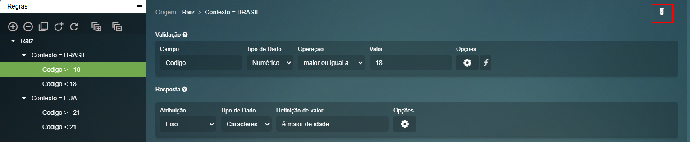
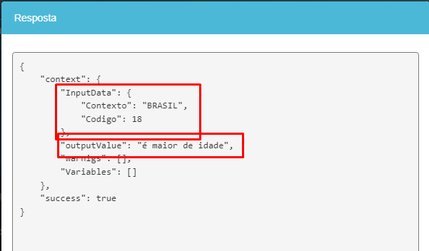
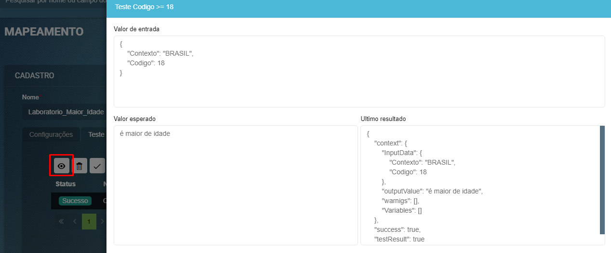
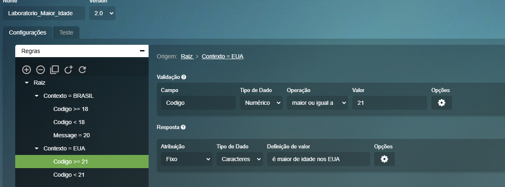

# Mapeamento  

## Objetivo principal

O principal objetivo do mapeamento é determinar uma resposta para cada entrada por meio de um processo de validação. Essa validação ocorre por meio da criação de regras, onde cada entrada recebe uma resposta específica.

Cada nó contém uma validação, que caso seja verdadeira a resposta daquele nó é retornada.

Veja o exemplo abaixo:


*para enteder oque é um OU EXCLUSIVO, ver seção [operadores](#Operadores)*

O exemplo do mapeamento apresentado na imagem estabelece regras de decisão para determinar a maioridade de uma pessoa com base no contexto (Brasil ou EUA) e na idade informada. O diagrama segue um fluxo estruturado em dois níveis de decisão:

*Nível 1*: Identifica se o contexto da avaliação é "BRASIL" ou "EUA". Esse é um critério exclusivo, ou seja, a entrada deve pertencer a apenas um dos dois contextos.

*Nível 2*: Com base no contexto selecionado, verifica se a idade informada atende aos critérios de maioridade estabelecidos para o país correspondente.

O fluxo garante que cada entrada seja processada corretamente e tenha uma resposta específica, como:

- *"É maior de idade"* (Brasil, 18 anos ou mais)
- *"É menor de idade"* (Brasil, menor de 18 anos)
- *"É maior de idade nos EUA"* (EUA, 21 anos ou mais)
- *"É menor de idade nos EUA"* (EUA, menor de 21 anos)
- *"Entrada fora do escopo"* (casos não previstos nesta configuração)
Caso a entrada não se enquadre nos critérios estabelecidos, o fluxo leva ao caminho "Padrão", indicando que a informação está fora do escopo das regras definidas.

Agora mostraremos como este exemplo seria configurado no BALM

Configuração do nível 1:


Configuração do nível 2 quando o Contexto é BRASIL:


Configuração do nível 2 quando o Contexto é EUA:


Configuração da resposta padrão:


Neste exemplo, a resposta é um texto. No entanto, existem outros tipos de saída possíveis. Atualmente, os seguintes tipos estão disponíveis:
- Caracteres/Texto
- Número
- Data
- Objeto (ou JSON)

Os tipos mencionados acima são utilizados quando é necessário definir um valor fixo para a resposta. No entanto, caso seja preciso que o valor seja variável, é possível utilizar uma propriedade do BALM.


#### Operadores

Em cada nível, você seleciona o operador desejado. Os operadores disponíveis são:

- XOR (OU Exclusivo): Utiliza a resposta deste nó apenas se ele for o único verdadeiro no seu nível.
- AND (E): Utiliza a resposta deste nó somente se ele e todos os anteriores no mesmo nível forem verdadeiros.
- OR (OU): Utiliza a resposta do primeiro nó que for verdadeiro no mesmo nível.

Suponha que você tenha um sistema de login com dois métodos: reconhecimento facial e senha. Veja como estes operadores se comportaria:
- XOR: o usuário só pode entrar se apenas um dos métodos for bem-sucedido. Veja abaixo:
    - Reconhecimento facial = Verdadeiro, Senha = Falso → Acesso concedido ✅
    - Reconhecimento facial = Falso, Senha = Verdadeiro → Acesso concedido ✅
    - Reconhecimento facial = Verdadeiro, Senha = Verdadeiro → Acesso negado ❌
    - Reconhecimento facial = Falso, Senha = Falso → Acesso negado ❌

- OR: o usuário só pode entrar se pelo menos um dos métodos for bem-sucedido. Veja abaixo:
    - Reconhecimento facial = Verdadeiro, Senha = Falso → Acesso concedido ✅
    - Reconhecimento facial = Falso, Senha = Verdadeiro → Acesso concedido ✅
    - Reconhecimento facial = Verdadeiro, Senha = Verdadeiro → Acesso concedido ✅
    - Reconhecimento facial = Falso, Senha = Falso → Acesso negado ❌

- AND: o usuário só pode entrar se os dois métodos forem bem-sucedidos. Veja abaixo:
    - Reconhecimento facial = Verdadeiro, Senha = Falso → Acesso negado ❌
    - Reconhecimento facial = Falso, Senha = Verdadeiro → Acesso negado ❌
    - Reconhecimento facial = Verdadeiro, Senha = Verdadeiro → Acesso concedido ✅
    - Reconhecimento facial = Falso, Senha = Falso → Acesso negado ❌

## Testes

Para acessar a funcionalidade de teste, clique no botão destacado em vermelho:



Ao abrir o modal de teste, o BALM preencherá automaticamente os campos de entrada com valores padrão para minimizar a necessidade de digitação manual:


Clicando em "Visualização", você pode alternar o modo de exibição para JSON:


Para testar o resultado, clique em "Executar". O retorno será um JSON contendo:
- InputData: Os valores de entrada do mapeamento.
- outputValue: O resultado processado pelo mapeamento.  



#### Como reutilizar um teste

Se deseja salvar uma configuração de teste para uso futuro, clique em "Salvar" e depois acesse a aba "Teste":


Na nova aba aberta, defina um nome para identificar seu teste. O campo "Valor esperado" deve conter o resultado esperado para a configuração atual, sendo essencial para validar o sucesso do teste. Após preencher, clique em "Salvar" para armazenar o teste.

Em seguida, vá para a aba "Teste". Você pode:
- Selecionar um dos testes e clicar no botão de check para rodar um teste unitário.
- Clicar no botão de double-check para executar todos os testes salvos.


Quando um teste é salvo, você tem a opção de visualizar sua configuração. Para isso, basta clicar no ícone de olho. Isso abrirá uma modal exibindo os seguintes dados:

- Valores de entrada configurados: Os parâmetros utilizados no teste.
- Valor esperado: O resultado esperado para esse teste.
- Resultado do último teste: O valor retornado pela execução mais recente.

Exemplo:




## Configurações avançadas 

Na seção de Configurações Avançadas, é possível escrever scripts JavaScript ou utilizar funções pré-definidas:


Atualmente, as funções disponíveis são:
- Remover caracteres especiais
- Remover espaços iniciais e finais

### JavaScript de validação


O JavaScript é executado antes da validação configurada do nó. Isso significa que você pode formatar ou manipular o campo de entrada antes de ele ser avaliado pela validação. Veja o exemplo abaixo:

Configuração:


JavaScript:
```JS
Contexto = Contexto.replace("BR", "BRASIL")
```
Entrada:


Resultado:


_Observe que o valor de "Contexto" foi alterado de "BR" para "BRASIL" antes da validação ser aplicada. Isso permite a modificação do campo de entrada para que ele se encaixe melhor na lógica de validação._

### JavaScript de resposta

Este código de JavaScript é acionado sempre que a validação for verdadeira e é executado por último. Nele, é possível modificar o outputValue (resposta) do mapeamento, através da variável "response". Essa função é especialmente útil para formatar a resposta conforme necessário. Confira o exemplo abaixo:

Configuração:


JavaScript:
```JS
response = response + "(Alterado pelo JS)"
```
Entrada:


Resultado:


## Uso de mapeamento no JavaScript

A função responsável por invocar o mapeamento é a *BALM.Mapping*. O primeiro parâmetro dessa função é a string do nome do mapeamento previamente criado, enquanto o segundo é um objeto contendo os valores de entrada. O retorno da função corresponde ao valor de "outputValue" nos testes.

Abaixo, apresentamos um exemplo de como utilizá-la.

Configuração:



JavaScript:

```js
function main() {
    const inputData = {
        "Contexto": "EUA",
        "Codigo": 21
    };

    metadata.resultado = BALM.Mapping('Laboratorio_Maior_Idade', inputData).Result;
}
```

Resultado:


No BALM, um cenário comum é utilizar os campos do Tipo de Documento (armazenados na variável *metadata*) para gerar um novo campo, como, por exemplo, o campo *maiorIdade*, durante a importação do tipo de documento. Veja o exemplo abaixo

```js
function main() {
    metadata.maiorIdade = BALM.Mapping('Laboratorio_Maior_Idade', metadata).Result;
}
```

## Debug

Se um teste na aba "Teste" retornar "success": false, e este mesmo cenário for usado no Javascript, ocorrerá um erro no processamento:


Nesse caso, o "outputValue" exibirá o resultado do último nó processado com sucesso.


